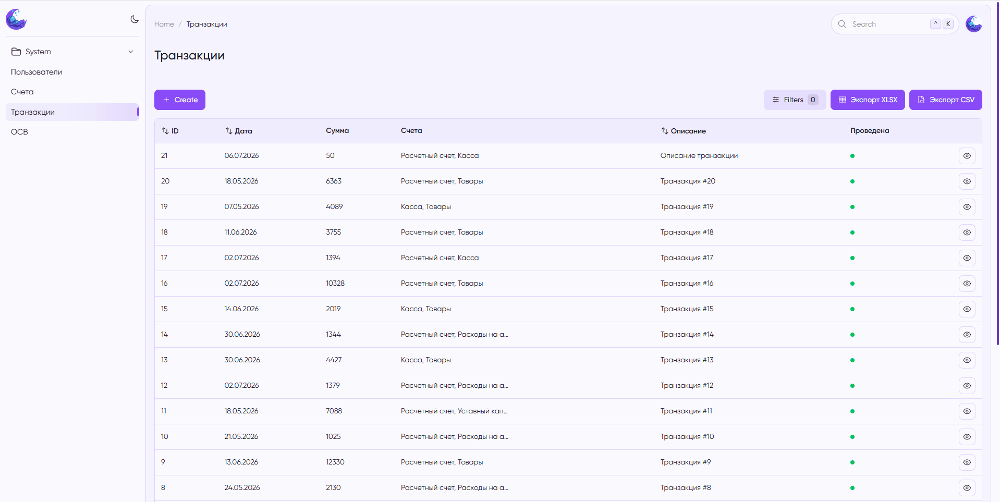
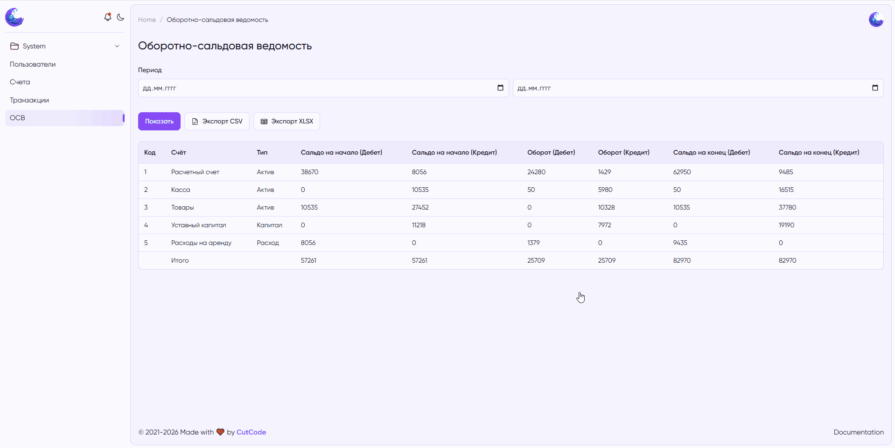
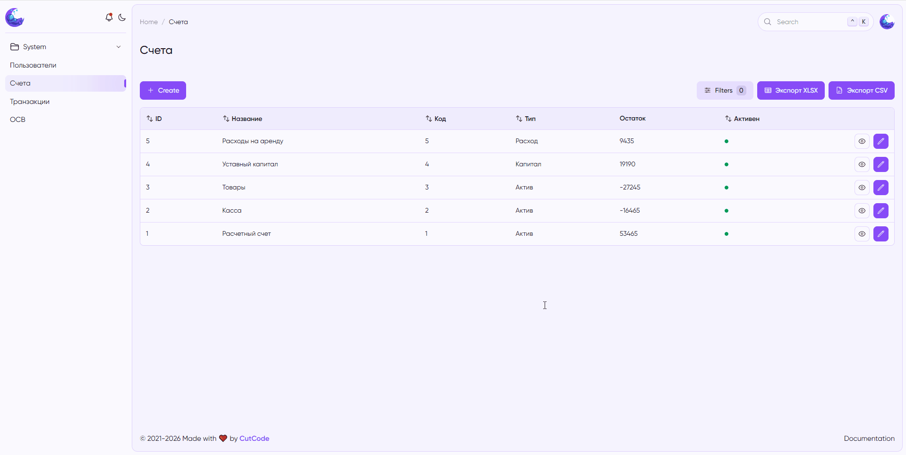
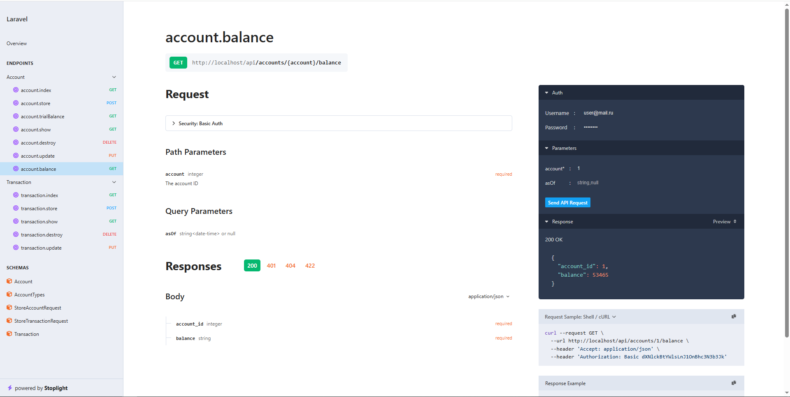

# Ledger App —  Система учета финансовых транзакций

Учебный проект, реализующий систему учета финансовых транзакций на основе принципов **двойной записи** (дебет/кредит). Содержит полноценную [административную панель (демо)](https://ledger.andrey-matyushin.ru/admin) на **MoonShine**, [REST API (демо)](https://ledger.andrey-matyushin.ru/docs/api) и автоматические тесты.
 
## Технологический стек

| Компонент | Технология |
|-----------|------------|
| Backend | PHP 8.5, Laravel 13 |
| База данных | PostgreSQL 18 |
| Админ-панель | MoonShine |
| Документация API | Scramble (OpenAPI) |
| Тестирование | PHPUnit |
| Контейнеризация | Docker, Laravel Sail (для разработки) |
| CI/CD | GitHub Actions |

## Основные возможности

- **Управление счетами** (CRUD) — активные, пассивные, капитал, доходы, расходы.
- **Управление транзакциями** с динамическими проводками (минимум 2 проводки, сумма дебета = кредиту).
- **Запрет изменения/удаления** проведённых транзакций.
- **Автоматический расчет остатков** по счету (с кэшированием).
- **Оборотно-сальдовая ведомость** (ОСВ) за выбранный период с экспортом в CSV/XLSX.
- **Административная панель** на MoonShine: управление счетами и транзакциями, фильтры, экспорт.
- **REST API** с Basic-аутентификацией:
  - Создание транзакции.
  - Получение остатка по счету.
  - Получение ОСВ в JSON.
- **Юнит-тесты** (PHPUnit) на бизнес-логику и валидацию.

---

## Установка и запуск

### Вариант 1: Без Sail

Убедитесь, что на вашем компьютере установлены **PHP 8.5+**, **Composer**, **PostgreSQL** и **Git**.

```bash
# 1. Клонировать репозиторий
git clone https://github.com/MatAndrey/ledger-app.git
cd ledger-app

# 2. Скопировать .env
cp .env.example .env

# 3. Настройте подключение к базе данных в файле .env
DB_CONNECTION=pgsql
DB_HOST=127.0.0.1
DB_PORT=5432
DB_DATABASE=ledger
DB_USERNAME=your_username
DB_PASSWORD=your_password

# 4. Установить зависимости PHP
composer install

# 5. Сгенерировать ключ приложения
php artisan key:generate

# 6. Выполнить миграции и наполнить базу тестовыми данными
php artisan migrate:fresh --seed

# 7. Запустить встроенный сервер Laravel
php artisan serve
```

После этого приложение будет доступно по адресу http://localhost:8000.

Админ-панель: http://localhost:8000/admin

Документация API (Scramble): http://localhost:8000/docs/api

### Вариант 2: С использованием Sail

Этот способ использует Laravel Sail — лёгкую обёртку над Docker Compose. Убедитесь, что у вас установлены Docker и Docker Compose.

```bash
# 1. Клонировать репозиторий
git clone https://github.com/MatAndrey/ledger-app.git
cd ledger-app

# 2. Скопировать .env
cp .env.example .env

# 3. Запустите сборку и установку через Makefile
make install

# Остановка контейнеров
./vendor/bin/sail down
```

Команда make install автоматически:

- Поднимет контейнеры (PHP, PostgreSQL, Nginx) через Sail.
- Установит зависимости Composer.
- Выполнит миграции и сидеры.
- Сгенерирует ключ приложения.

После успешного завершения приложение будет доступно по адресу http://localhost.

Админ-панель: http://localhost/admin

Документация API: http://localhost/docs/api

### Учётные данные

|| Email | Пароль |
|-----------|------------|------------|
| API | user@mail.ru | password |
| MoonShine | admin@mail.ru | admin |

## Тестирование
Запуск всех тестов (Unit + Feature):
```bash
php artisan test
# или
./vendor/bin/sail artisan test
```

## API Документация

Документация генерируется автоматически с помощью **Scramble** и доступна по адресу:

```
/docs/api
```

Также можно просмотреть OpenAPI-спецификацию в формате JSON:
```
/docs/api.json
```

## Демонстрация работы

Создание транзакции с проверкой на дебет = кредит, запрет на изменение проведенной транзакции.



Экспорт транзакций в .xlsx по выбранным фильтрам.


Генерация и экспорт оборотно-сальдовой ведомости


Создание счёта с автоматическим расчётом остатка.


Пример страницы документации к API.
